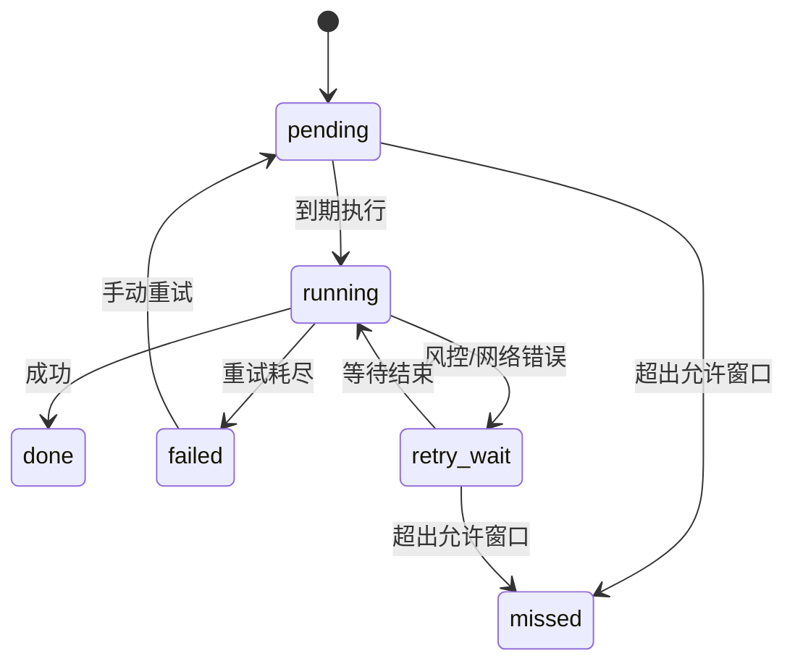

# 单账号定时采集与互动快照模块 PRD

## 1. 文档信息

- 版本：v0.2
- 日期：2026-09-14
- 目标平台：抖音
- 目标形态：单账号持续监控模块
- 主要使用方：个人学习、研究与小规模内容分析

## 2. 背景

MediaCrawler 当前已支持抖音创作者主页抓取、时间区间筛选、风控等待重试和固定时间调度。但现有能力更接近“一次性任务执行”，不适合持续追踪单个账号的作品表现和选题变化。

主要问题：

1. 每次任务重新抓取，JSON 存储容易产生重复记录。
2. 没有增量发现机制，无法只处理新作品。
3. 没有互动快照历史，只能看到最近一次数据。
4. 没有待执行任务队列，无法在 1h、6h、24h、72h、7d 等时间点准确采集。
5. 没有月度选题偏好分析。

## 3. 产品目标

构建一个面向单账号的持续采集模块，实现：

1. 每 30 分钟发现目标账号的新作品。
2. 保存账号、平台、作品 ID、正文、发布时间和规范 URL。
3. 第一次发现作品时保存 `first_seen` 首次观测快照。
4. 在作品发布后的 1h、6h、24h、72h、7d 采集互动数据快照。
5. 支持失败重试、风控等待、窗口内延迟执行和 missed 状态追踪。
6. 每月更新近期选题偏好和主题表现报告。

## 4. 非目标

首个版本不做：

1. 多账号批量监控。
2. 自动下载视频、图片或音频文件。
3. 评论全量采集和评论情绪分析。
4. 跨平台统一监控。
5. 自动发布、自动互动或账号运营操作。
6. 绕过平台安全机制或验证码。

## 5. 核心用户场景

### 场景 A：持续监控单账号

用户配置一个抖音账号链接，启用监控后，系统每 30 分钟检查一次新作品。

### 场景 B：追踪作品表现

系统发现新作品后，立即保存一条 `first_seen` 首次观测快照，并自动安排 1h、6h、24h、72h、7d 五个互动快照任务。

### 场景 C：查看近期选题偏好

每月 1 日，系统分析最近 30～60 天作品，输出高频标签、关键词和高互动主题。

### 场景 D：失败恢复

如果快照任务因风控、关机或网络问题失败，系统只在允许执行窗口内等待并重试；超过窗口后标记为 `missed`。

## 6. 用户流程


## 7. 功能需求

### FR-01 账号配置

- 支持输入抖音创作者主页 URL 或 `sec_user_id`。
- 默认发现间隔为 30 分钟。
- 支持启用和停用监控。
- 首版仅允许一个启用账号。

验收标准：

- 保存后能读取账号状态。
- 停用后不再产生新的发现任务。

### FR-02 增量发现

- 每 30 分钟请求目标账号最新作品列表。
- 从最新页开始读取，遇到已经存在的 `aweme_id` 后停止继续翻页。
- 仅对新作品执行入库和任务生成。
- 除检查到期快照外，不重复抓取全部历史作品。
- 第一次运行时建立基线，可配置是否保存历史作品。
- 对已错过快照时间的历史作品，只标记 `missed`，不抓取当前累计值倒填旧阶段。

验收标准：

- 连续运行两次不会重复插入同一作品。
- 发现新作品后能写入正文、发布时间、作品 ID 和作品 URL。

### FR-03 作品入库

作品基础字段：

- `platform`
- `aweme_id`
- `sec_user_id`
- `title`
- `desc`
- `create_time`
- `first_seen_at`
- `canonical_url`
- `source`

验收标准：

- `platform + aweme_id` 唯一。
- 重复发现只更新基础信息，不创建重复作品。

### FR-04 快照任务生成

以作品发布时间为基准生成以下任务：

- 发布后 1 小时
- 发布后 6 小时
- 发布后 24 小时
- 发布后 72 小时
- 发布后 7 天

任务字段：

- `job_id`
- `aweme_id`
- `stage`
- `due_at`
- `status`
- `attempts`
- `last_error`
- `created_at`
- `finished_at`

验收标准：

- 每个新作品只生成一组未完成任务。
- 任务时间基于发布时间，而不是发现时间。
- 已存在作品不会被重新抓取全部历史详情。

### FR-04.1 首次发现快照

- 新作品第一次入库时立即写入 `stage=first_seen` 的快照。
- `captured_at` 使用第一次发现时间。
- `actual_age_seconds` 按发现时间减去作品发布时间计算。
- 首次快照不得与 1h 快照合并。
- 已存在但没有 first_seen 的历史作品不得事后倒填，除非明确标记为 baseline。

### FR-05 快照执行

互动字段：

- 点赞数
- 收藏数
- 评论数
- 转发数
- 实际观测时间 `captured_at`
- 实际发布后年龄 `actual_age_seconds`

执行规则：

- 同一时间只允许一个浏览器采集进程。
- 多个到期任务应尽量合批执行。
- 每个调度周期只处理已经到期的快照任务。
- 快手、B站等其他平台逻辑保持不变。

验收标准：

- 每个任务执行后生成一条不可覆盖的快照记录。
- 可以看到计划时间、实际观测时间和实际发布后年龄。
- 实际年龄通过 `captured_at - create_time` 计算，不使用计划值代替。

### FR-06 错过与失败处理

- 遇到风控时沿用现有等待 10 分钟重试机制。
- 达到最大重试次数后标记为 `failed`。
- 如果任务超过允许执行窗口才恢复，直接将对应阶段标记为 `missed`。
- `missed` 阶段不得使用后来的累计互动值倒填。
- 不允许因为延迟重试而把 24h 的累计数据伪装成 1h 快照。
- 服务恢复后只继续执行未来到期或仍处于允许窗口内的任务。

建议允许执行窗口：

| 阶段 | 计划时间 | 建议允许窗口 | 超过窗口 |
|---|---|---|---|
| 1h | 发布后 1 小时 | 30 分钟 | missed |
| 6h | 发布后 6 小时 | 2 小时 | missed |
| 24h | 发布后 24 小时 | 6 小时 | missed |
| 72h | 发布后 72 小时 | 12 小时 | missed |
| 7d | 发布后 7 天 | 24 小时 | missed |

窗口内执行时仍必须记录实际 `captured_at` 和 `actual_age_seconds`，不得用计划的 1h、6h、24h 等数值代替实际年龄。

验收标准：

- 应用重启后任务状态不丢失。
- 风控失败不会导致任务队列丢失。
- 错过的历史快照有明确 `missed` 状态。

### FR-07 状态查询

系统需要提供：

- 监控账号状态
- 最近一次发现时间
- 下次发现时间
- 待执行任务数
- 已完成任务数
- 失败任务数
- 最近一次错误

### FR-08 月度选题偏好

建议每月 1 日或每周一运行一次分析。

第一版输出：

- 高频标签 Top 20
- 标题高频关键词 Top 20
- 正文高频关键词 Top 20
- 高互动作品 Top 10
- 与上一周期相比的主题变化

暂不做：

- 复杂语义聚类
- 情感分析
- AI 自动创作建议

### FR-09 WebUI

新增“账号监控”面板：

- 账号 URL
- 启用开关
- 发现频率
- 快照阶段显示
- 下次发现时间
- 任务统计
- 最近一次发现结果
- 月度分析入口

## 8. 数据模型

### 8.1 douyin_monitored_accounts

| 字段 | 类型 | 说明 |
|---|---|---|
| id | INTEGER | 主键 |
| sec_user_id | TEXT | 抖音匿名用户标识 |
| profile_url | TEXT | 主页链接 |
| enabled | BOOLEAN | 是否启用 |
| discover_interval_minutes | INTEGER | 发现间隔 |
| last_discovered_at | INTEGER | 最近发现时间 |
| created_at | INTEGER | 创建时间 |
| updated_at | INTEGER | 更新时间 |

### 8.2 douyin_posts

| 字段 | 类型 | 说明 |
|---|---|---|
| id | INTEGER | 主键 |
| platform | TEXT | 平台标识，首版固定为 dy |
| aweme_id | TEXT | 作品 ID |
| sec_user_id | TEXT | 所属账号 |
| title | TEXT | 标题 |
| desc | TEXT | 正文 |
| create_time | INTEGER | 发布时间 |
| first_seen_at | INTEGER | 首次发现时间 |
| canonical_url | TEXT | 规范作品 URL |
| status | TEXT | active/deleted/unavailable |

唯一约束建议：`UNIQUE(platform, aweme_id)`

### 8.3 douyin_post_snapshots

| 字段 | 类型 | 说明 |
|---|---|---|
| id | INTEGER | 主键 |
| platform | TEXT | 平台标识，首版固定为 dy |
| aweme_id | TEXT | 作品 ID |
| stage | TEXT | first_seen/1h/6h/24h/72h/7d |
| due_at | INTEGER | 计划采集时间 |
| captured_at | INTEGER | 实际采集时间 |
| actual_age_seconds | INTEGER | 实际发布后年龄，单位秒 |
| liked_count | INTEGER | 点赞数 |
| collected_count | INTEGER | 收藏数 |
| comment_count | INTEGER | 评论数 |
| share_count | INTEGER | 转发数 |
唯一约束建议：`UNIQUE(platform, aweme_id, stage)`

### 8.4 douyin_monitor_jobs

| 字段 | 类型 | 说明 |
|---|---|---|
| id | INTEGER | 主键 |
| job_type | TEXT | discover/snapshot/topic |
| aweme_id | TEXT | 关联作品，可为空 |
| stage | TEXT | 快照阶段 |
| due_at | INTEGER | 到期时间 |
| status | TEXT | pending/running/done/failed/missed/skipped |
| attempts | INTEGER | 已尝试次数 |
| last_error | TEXT | 最近错误 |
| miss_reason | TEXT | missed 或 failed 的原因 |
| created_at | INTEGER | 创建时间 |
| finished_at | INTEGER | 完成时间 |

### 8.5 douyin_topic_profiles

| 字段 | 类型 | 说明 |
|---|---|---|
| id | INTEGER | 主键 |
| sec_user_id | TEXT | 账号 |
| period_start | TEXT | 分析周期开始 |
| period_end | TEXT | 分析周期结束 |
| top_tags | TEXT | 高频标签 |
| top_keywords | TEXT | 高频关键词 |
| best_posts | TEXT | 高互动作品 |
| generated_at | INTEGER | 生成时间 |

## 9. 任务状态机



## 10. 技术方案建议

### 10.1 存储

使用 SQLite + SQLAlchemy，原因：

- 单账号数据量小。
- 支持唯一键、索引和事务。
- 适合任务状态和快照历史。
- 不需要额外数据库服务。

### 10.2 调度

扩展现有 [scheduler.py](../api/services/scheduler.py)：

- 每 60 秒检查一次到期任务。
- 每 30 分钟生成一次发现任务。
- 月度分析由独立定时任务触发。

### 10.3 抓取

复用现有：

- CDP 浏览器连接与登录态
- 风控等待重试
- 创作者作品列表
- 评论配置开关

建议优先从作品列表接口获取基础信息和互动数据，减少详情请求。若字段不足，再按需请求详情。

### 10.4 文件布局建议

```text
api/
  routers/
    monitor.py
  services/
    monitor_service.py
    snapshot_service.py
    topic_service.py
database/
  models.py
webui/
  src/components/monitor/
```

## 11. API 草案

| 方法 | 路径 | 说明 |
|---|---|---|
| GET | `/api/monitor/status` | 获取监控状态 |
| POST | `/api/monitor/config` | 保存监控配置 |
| POST | `/api/monitor/discover` | 手动触发发现 |
| GET | `/api/monitor/posts` | 查询作品 |
| GET | `/api/monitor/snapshots` | 查询快照 |
| GET | `/api/monitor/jobs` | 查询任务 |
| POST | `/api/monitor/jobs/{id}/retry` | 手动重试 |
| POST | `/api/monitor/topic/analyze` | 手动生成选题分析 |

## 12. 非功能需求

- 持久化：服务重启后任务和快照不丢失。
- 去重：`aweme_id` 唯一，`aweme_id + stage` 快照唯一。
- 幂等：重复执行发现任务不产生重复作品。
- 并发控制：同一时间只运行一个浏览器采集进程。
- 可观测性：所有任务状态、错误、实际年龄和 missed 情况可查询。
- 时区：内部存 UTC 或 Unix 时间戳，界面按本地时间显示。
- 频率限制：默认发现间隔 30 分钟。

## 13. 验收标准

MVP 完成后应满足：

1. 添加一个抖音账号后可以启用监控。
2. 第一次运行建立作品基线。
3. 第二次运行只处理新作品。
4. 每个新作品自动生成 5 个快照任务。
5. 任务到期后能采集互动数据并写入快照表。
6. 实际观测时间和实际发布后年龄被正确记录。
7. 超出允许窗口的历史快照被标记为 `missed`，不会倒填。
8. 应用重启后任务仍能继续。
9. 风控失败后按现有逻辑等待重试。
10. WebUI 能查看任务和结果。
11. 月度分析能输出标签和关键词排行。

## 14. 里程碑

### M0：PRD 与数据模型

- 完成本文档
- 确定数据库表结构
- 确定 `missed` 判定规则

### M1：作品与任务入库

- 新增模型和初始化语句
- 实现作品去重和任务创建

### M2：增量发现

- 实现单账号最新作品检查
- 实现首次基线
- 实现手动触发

### M3：快照执行

- 实现到期任务查询
- 实现批量快照采集
- 实现重试、`missed` 标记和禁止倒填

### M4：WebUI

- 监控配置面板
- 任务状态面板
- 作品与快照查询

### M5：月度选题分析

- 标签和关键词统计
- 高互动作品排行
- 周期对比

## 15. 风险与对策

| 风险 | 影响 | 对策 |
|---|---|---|
| 抖音风控 | 快照失败或延迟 | 降低频率、合并请求、等待重试 |
| 作品被删除 | 缺失后续快照 | 标记 unavailable，后续任务标记 missed |
| 接口字段变化 | 数据缺失 | 字段兼容和日志告警 |
| JSON 重复 | 统计失真 | 使用 SQLite 唯一键 |
| 浏览器登录失效 | 调度无法执行 | 使用持久化专用浏览器 Profile |
| 电脑关机 | 错过快照时间 | 超出窗口后标记 missed，不使用后续累计值倒填 |

## 16. 待确认问题

1. 每个快照阶段的允许执行窗口如何定义。
2. 首次运行是否需要回填历史作品。
3. 互动数据以列表接口为准还是详情接口为准。
4. 月度分析是否需要接入大模型生成总结。
5. 是否需要导出 Excel 或 CSV 报告。

## 17. MVP 建议

第一版只做：

- 单账号
- SQLite
- 30 分钟发现一次
- 1h、6h、24h、72h、7d 快照
- 风控重试和 missed 标记
- WebUI 状态查看

先不做多账号、AI 选题分析和自动媒体下载。
